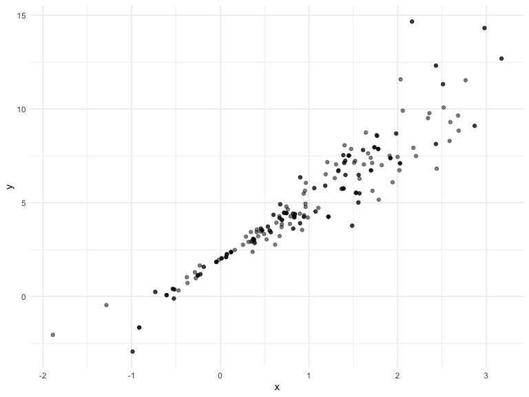
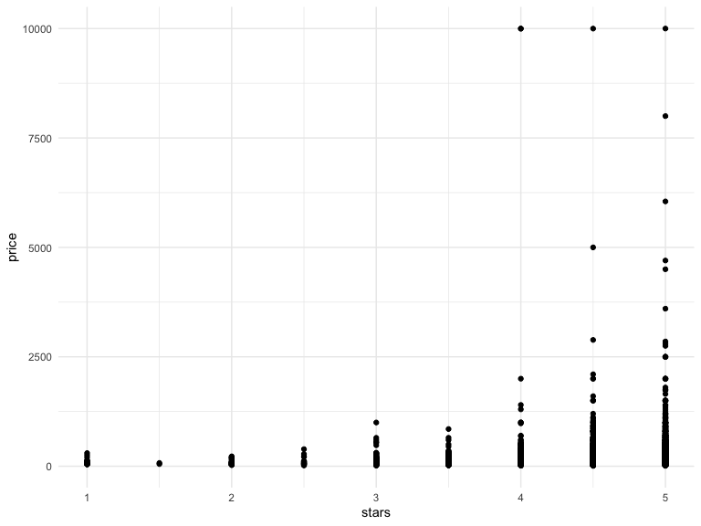
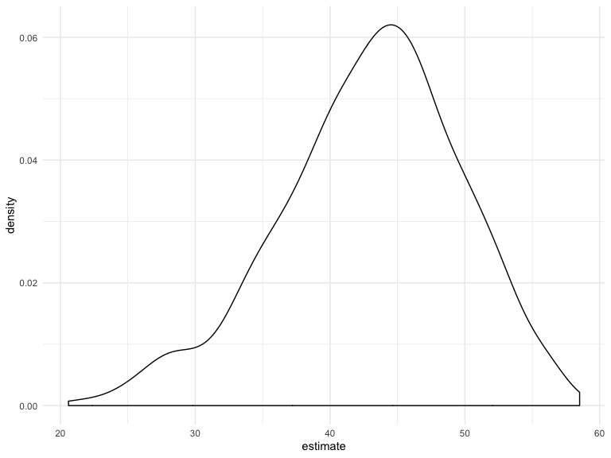

Bootstrapping
================
Matthew Parker
11/14/19

## boostrap

``` r
n_samp = 250

sim_df_const = 
  tibble(
    x = rnorm(n_samp, 1, 1),
    error = rnorm(n_samp, 0, 1),
    y = 2 + 3 * x + error
  )

sim_df_nonconst = sim_df_const %>% 
  mutate(
  error = error * .75 * x,
  y = 2 + 3 * x + error
)
# estimate of slope is ok, but CI for slope is not ok due to non-constant variance of error term
```

Show results

``` r
sim_df = 
  bind_rows(const = sim_df_const, nonconst = sim_df_nonconst, .id = "data_source") 

sim_df %>% 
  ggplot(aes(x = x, y = y)) + 
  geom_point(alpha = .5) +
  stat_smooth(method = "lm") +
  facet_grid(~data_source) 
```


Fit two models

``` r
sim_df_const %>% 
  lm(y ~ x, data = .) %>% 
  broom::tidy()
```

    ## # A tibble: 2 x 5
    ##   term        estimate std.error statistic   p.value
    ##   <chr>          <dbl>     <dbl>     <dbl>     <dbl>
    ## 1 (Intercept)     1.98    0.0981      20.2 3.65e- 54
    ## 2 x               3.04    0.0699      43.5 3.84e-118

``` r
sim_df_nonconst %>% 
  lm(y ~ x, data = .) %>% 
  broom::tidy()
```

    ## # A tibble: 2 x 5
    ##   term        estimate std.error statistic   p.value
    ##   <chr>          <dbl>     <dbl>     <dbl>     <dbl>
    ## 1 (Intercept)     1.93    0.105       18.5 1.88e- 48
    ## 2 x               3.11    0.0747      41.7 5.76e-114

## how can i bootstrap

write a function to draw a bootstrap sample based on a dataframe

``` r
boot_sample = function(df) {
  
  sample_frac(df, size = 1, replace = TRUE)
  
}
```

``` r
boot_sample(sim_df_nonconst) %>% 
  ggplot(aes(x = x, y = y)) +
  geom_point(alpha = 0.5)
```



Organize a dataframe

``` r
boot_straps = 
  tibble(
    strap_num = 1:1000,
    strap_sample = rerun(1000, boot_sample(sim_df_nonconst))
  )
```

Do some kind of analysis

``` r
bootstrap_results =
  boot_straps %>% 
  mutate(
    models = map(strap_sample, ~lm(y ~ x, data = .x)),
    results = map(models, broom::tidy)
  ) %>% 
  select(-strap_sample, -models) %>% 
  unnest(results)
```

summarize these
results

``` r
# std error of slope here is higher than in the default model that R originally provided
bootstrap_results %>% 
  group_by(term) %>% 
  summarize(
    se = sd(estimate)
  )
```

    ## # A tibble: 2 x 2
    ##   term            se
    ##   <chr>        <dbl>
    ## 1 (Intercept) 0.0747
    ## 2 x           0.101

## try the modelr package

``` r
boot_straps = 
  sim_df_nonconst %>% 
  modelr::bootstrap(1000)
```

``` r
sim_df_nonconst %>% 
  modelr::bootstrap(n = 1000) %>% 
  mutate(
    models = map(strap, ~lm(y ~ x, data = .x) ),
    results = map(models, broom::tidy)) %>% 
  select(-strap, -models) %>% 
  unnest(results) %>% 
  group_by(term) %>% 
  summarize(boot_se = sd(estimate))
```

    ## # A tibble: 2 x 2
    ##   term        boot_se
    ##   <chr>         <dbl>
    ## 1 (Intercept)  0.0790
    ## 2 x            0.104

## what if your assumptions aren’t wrong?

``` r
sim_df_const %>% 
  lm(y ~ x, data = .) %>% 
  broom::tidy()
```

    ## # A tibble: 2 x 5
    ##   term        estimate std.error statistic   p.value
    ##   <chr>          <dbl>     <dbl>     <dbl>     <dbl>
    ## 1 (Intercept)     1.98    0.0981      20.2 3.65e- 54
    ## 2 x               3.04    0.0699      43.5 3.84e-118

``` r
sim_df_const %>% 
  modelr::bootstrap(n = 1000) %>% 
  mutate(
    models = map(strap, ~lm(y ~ x, data = .x) ),
    results = map(models, broom::tidy)) %>% 
  select(-strap, -models) %>% 
  unnest(results) %>% 
  group_by(term) %>% 
  summarize(boot_se = sd(estimate))
```

    ## # A tibble: 2 x 2
    ##   term        boot_se
    ##   <chr>         <dbl>
    ## 1 (Intercept)  0.101 
    ## 2 x            0.0737

## revisit Airbnb

``` r
data("nyc_airbnb")

nyc_airbnb = 
  nyc_airbnb %>% 
  mutate(stars = review_scores_location / 2) %>% 
  rename(
    boro = neighbourhood_group,
    neighborhood = neighbourhood) %>% 
  filter(boro != "Staten Island") %>% 
  select(price, stars, boro, neighborhood, room_type)
```

``` r
nyc_airbnb %>% 
  ggplot(aes(x = stars, y = price)) +
  geom_point()
```



Re-use the stuff I just did

``` r
airbnb_results =
  nyc_airbnb %>% 
  filter(boro == "Manhattan") %>% 
  modelr::bootstrap(n = 1000) %>% 
  mutate(
    models = map(strap, ~lm(price ~ stars, data = .x) ),
    results = map(models, broom::tidy)) %>% 
  select(results) %>% 
  unnest(results) 
```

Make a plot of the `stars` distribution

``` r
# Slope distribution is skewed, assumption of normal dist. is violated.
# To get conf. int., just take value from 2.5 and 97.5 percentile.
airbnb_results %>% 
  filter(term == "stars") %>% 
  ggplot(aes(x = estimate)) + geom_density()
```


